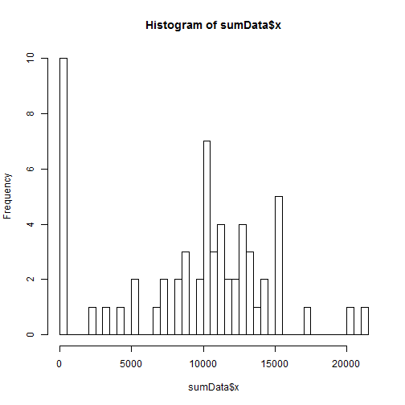
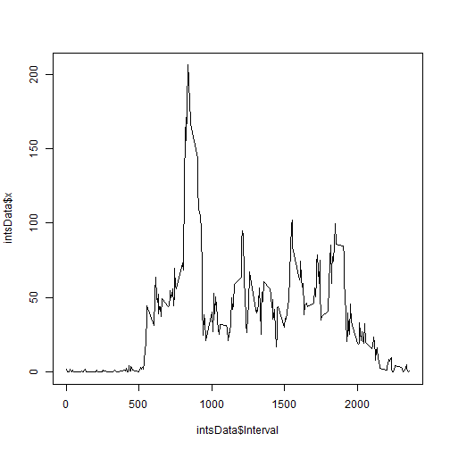
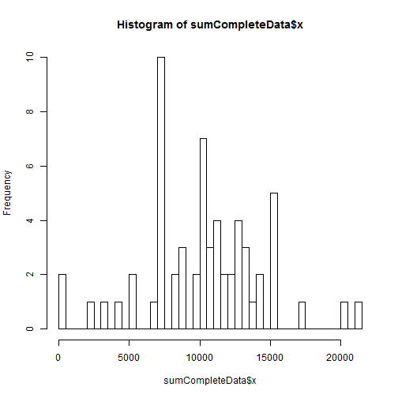
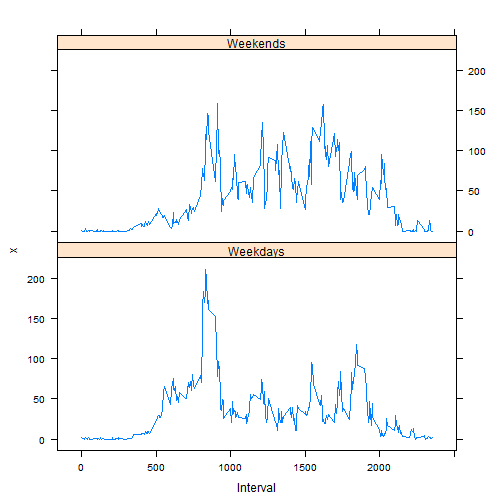

# Reproducible Research: Peer Assessment 1
The goal of this document is to process fitness data related to steps taken. The data is measured in five minute intervals.

Begin by pointing to the directory where the CSV file is saved.

```r
setwd("C:\\Users\\Owner\\Google Drive\\PROGRAMMING_SKILLS\\R\\Coursera\\ReproducibleResearch\\repdata-data-activity")
```
## Loading and preprocessing the data
We load the data file and store the data frame as a variable 'data'

```r
print(getwd())
```

```
## [1] "C:/Users/Owner/Google Drive/PROGRAMMING_SKILLS/R/Coursera/ReproducibleResearch/RepData_PeerAssessment1"
```

```r
data <- read.csv("C:\\Users\\Owner\\Google Drive\\PROGRAMMING_SKILLS\\R\\Coursera\\ReproducibleResearch\\repdata-data-activity\\activity.csv")
```


## What is mean total number of steps taken per day?
Use 'data' to create a data set 'sumData' that sums the number of steps taken each day.
Create a histogram of the steps taken daily.
Store the mean and median number of steps taken daily as variables 'meanSteps' and 'medianSteps'.

```r
sumData <- aggregate(data$steps, by=list(Date=data$date),FUN = sum, na.rm = TRUE)
hist(sumData$x, breaks = nrow(sumData))
```

 

```r
meanSteps <- mean(sumData[[2]])
medianSteps <- median(sumData[[2]])
meanSteps
```

```
## [1] 9354
```

```r
medianSteps
```

```
## [1] 10395
```

## What is the average daily activity pattern?
Use 'data' to create a data set 'intsData' that averages the number of steps taken in each five minute interval across all days.
Plot the data as a time series.
Find the interval in which the maximum number of steps is taken on average daily and store as variable 'maxInterval'.

```r
intsData <- aggregate(data$steps, by=list(Interval=data$interval),FUN = mean,na.rm=TRUE)
plot(intsData$Interval, intsData$x, type = "l")
```

 

```r
maxInterval <- intsData[which.max(intsData$x),1]
maxInterval
```

```
## [1] 835
```


## Imputing missing values
Find the total number of missing entries and store as variable 'totalNAs'.
Replace missing values with average value for that five minute interval.
Loop through the rows of 'data' to populate missing values in 'completeData'.
Create a histogram of the total number of steps taken each day.


```r
totalNAs <- colSums(is.na(data))[1]
completeData <- data
for (i in 1:nrow(completeData)) {
        if (is.na(completeData[i,1])==TRUE) {
                missingInt <- completeData[i,3]
                j <- (missingInt/5 + 1)
                completeData[i,1]<- intsData[j,2]
        }
        
}

sumCompleteData <- aggregate(completeData$steps, by=list(Date=completeData$date),FUN = sum, na.rm = TRUE)
hist(sumCompleteData$x, breaks = nrow(sumCompleteData))
```

 

```r
meanCompleteSteps <- mean(sumCompleteData[[2]])
medianCompleteSteps <- median(sumCompleteData[[2]])
meanCompleteSteps
```

```
## [1] 10282
```

```r
medianCompleteSteps
```

```
## [1] 10395
```


## Are there differences in activity patterns between weekdays and weekends?
Append a column of weekdays to 'completeData'.
Initialize a column for weekday/weekend binary.
Loop through the rows to define 'Weekends'.

```r
completeData$day <- weekdays(as.Date(completeData$date))
completeData$weekDays <- "Weekdays"
for (i in 1:nrow(completeData))
        if(completeData[i,4]=="Saturday"|completeData[i,4]=="Sunday"){
                completeData[i,5] <- 'Weekends'
        }
weekDayData <- aggregate(completeData$steps, by=list(Interval=completeData$interval,Weekdays=completeData$weekDays),FUN = mean,na.rm=TRUE)
library(lattice)
```

```
## Warning: package 'lattice' was built under R version 3.1.1
```

```r
xyplot(x ~ Interval | Weekdays, data = weekDayData, layout = c(1,2), type="l")
```

 
                
The resulting plot shows that there are clear differences in activity between weekends and weekdays. Weekday activity spikes in the morning and again in the afternoon with relative inactivity in between. Weekend also show a ramp up of activity in the morning, but with a more consistent level of activity throughout the day.
